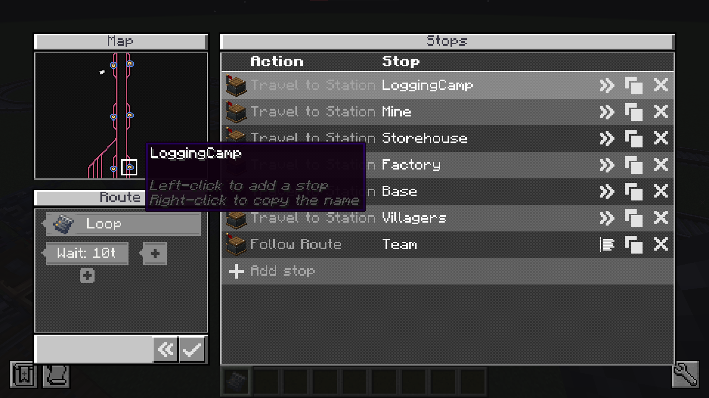

# Create: Routes

Write once, follow anywhere.

Add **Follow Route** to a Create schedule and pick a route: that one entry stands for the whole run. Default conditions save setting the same wait at every stop. A route can follow another route, so a trunk line stays as branches you can edit one at a time.

## Credits

Original textures from the [Create Mod](https://www.curseforge.com/minecraft/mc-mods/create), recoloured or drawn over for this mod's own art. See the repository [LICENSE](../LICENSE) for how that art is licensed.
